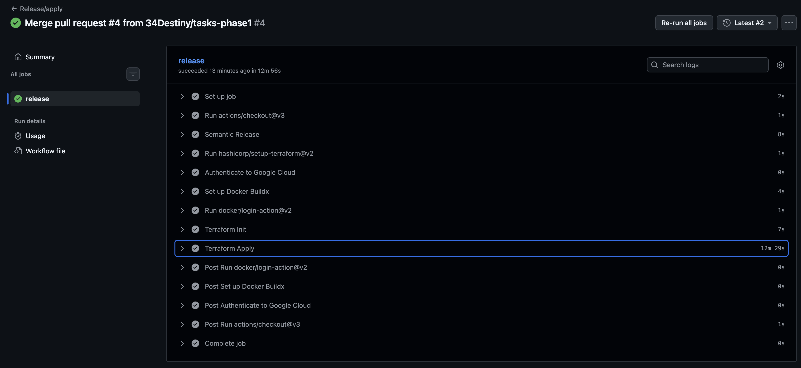
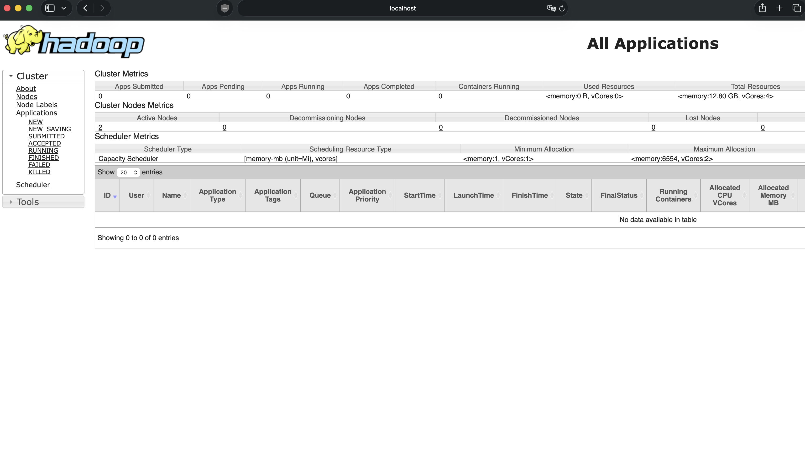
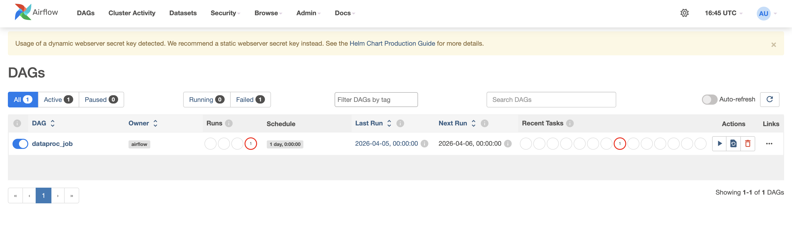
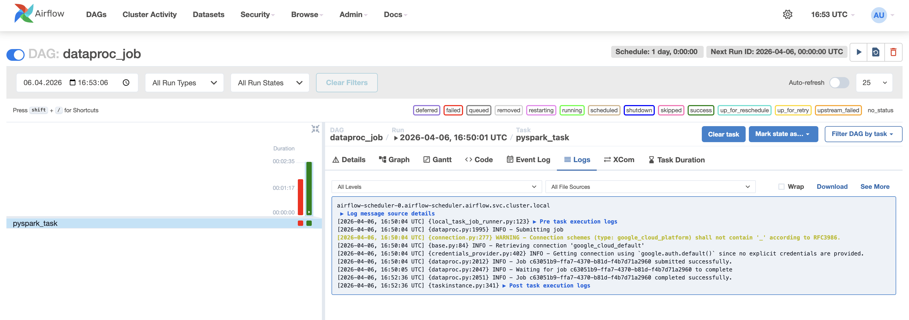
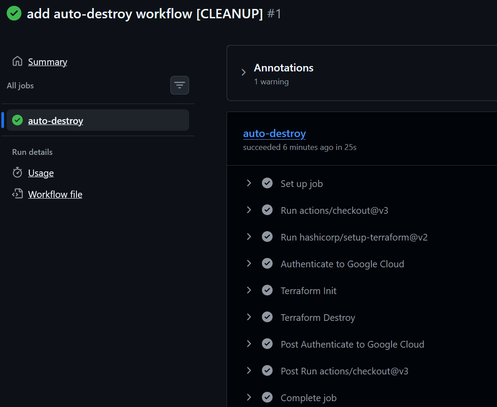

IMPORTANT ❗ ❗ ❗ Please remember to destroy all the resources after each work session. You can recreate infrastructure by creating new PR and merging it to master.


                                                                                                                                                                                                                                                                                                                                                                                  
## Phase 1 Exercise Overview

  ```mermaid
  flowchart TD
      A[🔧 Step 0: Fork repository] --> B[🔧 Step 1: Environment variables\nexport TF_VAR_*]
      B --> C[🔧 Step 2: Bootstrap\nterraform init/apply\n→ GCP project + state bucket]
      C --> D[🔧 Step 3: Quota increase\nCPUS_ALL_REGIONS ≥ 24]
      D --> E[🔧 Step 4: CI/CD Bootstrap\nWorkload Identity Federation\n→ keyless auth GH→GCP]
      E --> F[🔧 Step 5: GitHub Secrets\nGCP_WORKLOAD_IDENTITY_*\nINFRACOST_API_KEY]
      F --> G[🔧 Step 6: pre-commit install]
      G --> H[🔧 Step 7: Push + PR + Merge\n→ release workflow\n→ terraform apply]

      H --> I{Infrastructure\nrunning on GCP}

      I --> J[📋 Task 3: Destroy\nGitHub Actions → workflow_dispatch]
      I --> K[📋 Task 4: New branch\nModify tasks-phase1.md\nPR → merge → new release]
      I --> L[📋 Task 5: Analyze Terraform\nterraform plan/graph\nDescribe selected module]
      I --> M[📋 Task 6: YARN UI\ngcloud compute ssh\nIAP tunnel → port 8088]
      I --> N[📋 Task 7: Architecture diagram\nService accounts + buckets]
      I --> O[📋 Task 8: Infracost\nUsage profiles for\nartifact_registry + storage_bucket]
      I --> P[📋 Task 9: Spark job fix\nAirflow UI → DAG → debug\nFix spark-job.py]
      I --> Q[📋 Task 10: BigQuery\nDataset + external table\non ORC files]
      I --> R[📋 Task 11: Spot instances\npreemptible_worker_config\nin Dataproc module]
      I --> S[📋 Task 12: Auto-destroy\nNew GH Actions workflow\nschedule + cleanup tag]

      style A fill:#4a9eff,color:#fff
      style B fill:#4a9eff,color:#fff
      style C fill:#4a9eff,color:#fff
      style D fill:#ff9f43,color:#fff
      style E fill:#4a9eff,color:#fff
      style F fill:#ff9f43,color:#fff
      style G fill:#4a9eff,color:#fff
      style H fill:#4a9eff,color:#fff
      style I fill:#2ed573,color:#fff
      style J fill:#a55eea,color:#fff
      style K fill:#a55eea,color:#fff
      style L fill:#a55eea,color:#fff
      style M fill:#a55eea,color:#fff
      style N fill:#a55eea,color:#fff
      style O fill:#a55eea,color:#fff
      style P fill:#a55eea,color:#fff
      style Q fill:#a55eea,color:#fff
      style R fill:#a55eea,color:#fff
      style S fill:#a55eea,color:#fff
```

  Legend

  - 🔵 Blue — setup steps (one-time configuration)
  - 🟠 Orange — manual steps (GCP Console / GitHub UI)
  - 🟢 Green — infrastructure ready
  - 🟣 Purple — tasks to complete and document in tasks-phase1.md

1. Authors:

   ***enter your group nr:6***

   ***link to forked repo: https://github.com/34Destiny/tbd-workshop-1***

2. Follow all steps in README.md.

3. From available Github Actions select and run destroy on master branch.

4. Create new git branch and:
    1. Modify tasks-phase1.md file.

    2. Create PR from this branch to **YOUR** master and merge it to make new release.

    ***place the screenshot from GA after successful application of release***



5. Analyze terraform code. Play with terraform plan, terraform graph to investigate different modules.

    ***describe one selected module and put the output of terraform graph for this module here***

Do analizy wybrano moduł `module.dataproc`. Moduł ten odpowiada za utworzenie klastra Dataproc, który jest wykorzystywany do uruchamiania zadań Spark w środowisku Google Cloud. W module tworzony jest klaster Dataproc, konto serwisowe dla klastra, odpowiednie role IAM oraz dwa buckety w Google Cloud Storage wykorzystywane jako bucket staging oraz bucket tymczasowy.

Na podstawie wygenerowanego grafu Terraform można zauważyć, że głównym zasobem w tym module jest `google_dataproc_cluster.tbd-dataproc-cluster`. Klaster ten zależy od kilku innych zasobów, między innymi od włączenia usługi Dataproc (`google_project_service.dataproc`), utworzenia konta serwisowego (`google_service_account.dataproc_sa`) oraz przypisania odpowiednich ról IAM do tego konta. Dodatkowo klaster korzysta z bucketów w Google Cloud Storage, dla których również zostały nadane odpowiednie uprawnienia IAM.

Z grafu zależności można również zauważyć, że moduł Dataproc zależy od modułu sieciowego VPC, ponieważ klaster jest uruchamiany w konkretnej podsieci. Widać także zależność od modułu data-pipelines, który nadaje uprawnienia do bucketów dla konta serwisowego Dataproc. Dodatkowo release Airflow zależy od utworzenia klastra Dataproc, co oznacza, że Airflow wykorzystuje ten klaster do uruchamiania zadań przetwarzania danych.

### Terraform graph output for selected module:

```
  subgraph "cluster_module.dataproc" {
    label = "module.dataproc"
    "module.dataproc.google_dataproc_cluster.tbd-dataproc-cluster" [label="google_dataproc_cluster.tbd-dataproc-cluster"];
    "module.dataproc.google_project_iam_member.dataproc_bigquery_data_editor" [label="google_project_iam_member.dataproc_bigquery_data_editor"];
    "module.dataproc.google_project_iam_member.dataproc_bigquery_user" [label="google_project_iam_member.dataproc_bigquery_user"];
    "module.dataproc.google_project_iam_member.dataproc_worker" [label="google_project_iam_member.dataproc_worker"];
    "module.dataproc.google_project_service.dataproc" [label="google_project_service.dataproc"];
    "module.dataproc.google_service_account.dataproc_sa" [label="google_service_account.dataproc_sa"];
    "module.dataproc.google_storage_bucket.dataproc_staging" [label="google_storage_bucket.dataproc_staging"];
    "module.dataproc.google_storage_bucket.dataproc_temp" [label="google_storage_bucket.dataproc_temp"];
    "module.dataproc.google_storage_bucket_iam_member.staging_bucket_iam" [label="google_storage_bucket_iam_member.staging_bucket_iam"];
    "module.dataproc.google_storage_bucket_iam_member.temp_bucket_iam" [label="google_storage_bucket_iam_member.temp_bucket_iam"];
  "helm_release.airflow" -> "module.dataproc.google_dataproc_cluster.tbd-dataproc-cluster";
  "module.data-pipelines.google_storage_bucket_iam_member.tbd-code-bucket-iam-viewer" -> "module.dataproc.google_service_account.dataproc_sa";
  "module.data-pipelines.google_storage_bucket_iam_member.tbd-data-bucket-iam-editor" -> "module.dataproc.google_service_account.dataproc_sa";
  "module.dataproc.google_dataproc_cluster.tbd-dataproc-cluster" -> "module.dataproc.google_project_iam_member.dataproc_bigquery_data_editor";
  "module.dataproc.google_dataproc_cluster.tbd-dataproc-cluster" -> "module.dataproc.google_project_iam_member.dataproc_bigquery_user";
  "module.dataproc.google_dataproc_cluster.tbd-dataproc-cluster" -> "module.dataproc.google_project_iam_member.dataproc_worker";
  "module.dataproc.google_dataproc_cluster.tbd-dataproc-cluster" -> "module.dataproc.google_project_service.dataproc";
  "module.dataproc.google_dataproc_cluster.tbd-dataproc-cluster" -> "module.dataproc.google_storage_bucket_iam_member.staging_bucket_iam";
  "module.dataproc.google_dataproc_cluster.tbd-dataproc-cluster" -> "module.dataproc.google_storage_bucket_iam_member.temp_bucket_iam";
  "module.dataproc.google_project_iam_member.dataproc_bigquery_data_editor" -> "module.dataproc.google_service_account.dataproc_sa";
  "module.dataproc.google_project_iam_member.dataproc_bigquery_user" -> "module.dataproc.google_service_account.dataproc_sa";
  "module.dataproc.google_project_iam_member.dataproc_worker" -> "module.dataproc.google_service_account.dataproc_sa";
  "module.dataproc.google_project_service.dataproc" -> "module.vpc.google_compute_firewall.default-internal-allow-all";
  "module.dataproc.google_project_service.dataproc" -> "module.vpc.google_compute_firewall.fw-allow-ingress-from-iap";
  "module.dataproc.google_project_service.dataproc" -> "module.vpc.module.cloud-router.google_compute_router_nat.nats";
  "module.dataproc.google_project_service.dataproc" -> "module.vpc.module.vpc.module.firewall_rules.google_compute_firewall.rules";
  "module.dataproc.google_project_service.dataproc" -> "module.vpc.module.vpc.module.firewall_rules.google_compute_firewall.rules_ingress_egress";
  "module.dataproc.google_project_service.dataproc" -> "module.vpc.module.vpc.module.routes.google_compute_route.route";
  "module.dataproc.google_project_service.dataproc" -> "module.vpc.module.vpc.module.vpc.google_compute_shared_vpc_host_project.shared_vpc_host";
  "module.dataproc.google_service_account.dataproc_sa" -> "module.vpc.google_compute_firewall.default-internal-allow-all";
  "module.dataproc.google_service_account.dataproc_sa" -> "module.vpc.google_compute_firewall.fw-allow-ingress-from-iap";
  "module.dataproc.google_service_account.dataproc_sa" -> "module.vpc.module.cloud-router.google_compute_router_nat.nats";
  "module.dataproc.google_service_account.dataproc_sa" -> "module.vpc.module.vpc.module.firewall_rules.google_compute_firewall.rules";
  "module.dataproc.google_service_account.dataproc_sa" -> "module.vpc.module.vpc.module.firewall_rules.google_compute_firewall.rules_ingress_egress";
  "module.dataproc.google_service_account.dataproc_sa" -> "module.vpc.module.vpc.module.routes.google_compute_route.route";
  "module.dataproc.google_service_account.dataproc_sa" -> "module.vpc.module.vpc.module.vpc.google_compute_shared_vpc_host_project.shared_vpc_host";
  "module.dataproc.google_storage_bucket.dataproc_staging" -> "module.vpc.google_compute_firewall.default-internal-allow-all";
  "module.dataproc.google_storage_bucket.dataproc_staging" -> "module.vpc.google_compute_firewall.fw-allow-ingress-from-iap";
  "module.dataproc.google_storage_bucket.dataproc_staging" -> "module.vpc.module.cloud-router.google_compute_router_nat.nats";
  "module.dataproc.google_storage_bucket.dataproc_staging" -> "module.vpc.module.vpc.module.firewall_rules.google_compute_firewall.rules";
  "module.dataproc.google_storage_bucket.dataproc_staging" -> "module.vpc.module.vpc.module.firewall_rules.google_compute_firewall.rules_ingress_egress";
  "module.dataproc.google_storage_bucket.dataproc_staging" -> "module.vpc.module.vpc.module.routes.google_compute_route.route";
  "module.dataproc.google_storage_bucket.dataproc_staging" -> "module.vpc.module.vpc.module.vpc.google_compute_shared_vpc_host_project.shared_vpc_host";
  "module.dataproc.google_storage_bucket.dataproc_temp" -> "module.vpc.google_compute_firewall.default-internal-allow-all";
  "module.dataproc.google_storage_bucket.dataproc_temp" -> "module.vpc.google_compute_firewall.fw-allow-ingress-from-iap";
  "module.dataproc.google_storage_bucket.dataproc_temp" -> "module.vpc.module.cloud-router.google_compute_router_nat.nats";
  "module.dataproc.google_storage_bucket.dataproc_temp" -> "module.vpc.module.vpc.module.firewall_rules.google_compute_firewall.rules";
  "module.dataproc.google_storage_bucket.dataproc_temp" -> "module.vpc.module.vpc.module.firewall_rules.google_compute_firewall.rules_ingress_egress";
  "module.dataproc.google_storage_bucket.dataproc_temp" -> "module.vpc.module.vpc.module.routes.google_compute_route.route";
  "module.dataproc.google_storage_bucket.dataproc_temp" -> "module.vpc.module.vpc.module.vpc.google_compute_shared_vpc_host_project.shared_vpc_host";
  "module.dataproc.google_storage_bucket_iam_member.staging_bucket_iam" -> "module.dataproc.google_service_account.dataproc_sa";
  "module.dataproc.google_storage_bucket_iam_member.staging_bucket_iam" -> "module.dataproc.google_storage_bucket.dataproc_staging";
  "module.dataproc.google_storage_bucket_iam_member.temp_bucket_iam" -> "module.dataproc.google_service_account.dataproc_sa";
  "module.dataproc.google_storage_bucket_iam_member.temp_bucket_iam" -> "module.dataproc.google_storage_bucket.dataproc_temp";
```

6. Reach YARN UI

   ***place the command you used for setting up the tunnel, the port and the screenshot of YARN UI here***

   Hint: the Dataproc cluster has `internal_ip_only = true`, so you need to use an IAP tunnel.
   See: `gcloud compute ssh` with `-- -L <local_port>:localhost:<remote_port>` and `--tunnel-through-iap` flag.
   YARN ResourceManager UI runs on port **8088**.

```
gcloud compute ssh tbd-cluster-m --zone europe-west1-b --tunnel-through-iap -- -L 8088:localhost:8088
```



7. Draw an architecture diagram (e.g. in draw.io) that includes:
    1. Description of the components of service accounts
    2. List of buckets for disposal

    ***place your diagram here***

8. Create a new PR and add costs by entering the expected consumption into Infracost
For all the resources of type: `google_artifact_registry_repository`, `google_storage_bucket`
create a sample usage profiles and add it to the Infracost task in CI/CD pipeline. Usage file [example](https://github.com/infracost/infracost/blob/master/infracost-usage-example.yml)

   ***place the expected consumption you entered here***

   ***place the screenshot from infracost output here***

9. Find and correct the error in spark-job.py

    After `terraform apply` completes, connect to the Airflow cluster:
    ```bash
    gcloud container clusters get-credentials airflow-cluster --zone europe-west1-b --project PROJECT_NAME
    ```
    
    Then check the external IP (AIRFLOW_EXTERNAL_IP) of the webserver service:
    kubectl get svc -n airflow airflow-webserver                                                                                                                                                                 
                                              
                                                                                                                                                                                                               
    ▎ Note: If EXTERNAL-IP shows <pending>, wait a moment and retry — LoadBalancer IP allocation may take 1-2 minutes.  

    DAG files are synced automatically from your GitHub repo via git-sync sidecar.
    Airflow variables and the `google_cloud_default` GCP connection are also configured by Terraform.

    a) In the Airflow UI (http://AIRFLOW_EXTERNAL_IP:8080, login: admin/admin), find the `dataproc_job` DAG, unpause it and trigger it manually.

    ***place a screenshot of the DAG in the Airflow UI***



b) The DAG will fail. Examine the task logs in the Airflow UI to find the root cause.

```log
airflow.exceptions.AirflowException: Job failed:
...
pyspark_job {
  main_python_file_uri: "gs://tbd-2026l-331459-code/spark-job.py"
}
status {
  state: ERROR
  details: "Google Cloud Dataproc Agent reports job failure. If logs are available, they can be found at:
...
gs://tbd-2026l-331459-dataproc-staging/.../driveroutput.*"
}
```

   Po uruchomieniu DAG `dataproc_job` zadanie zakończyło się błędem. W logach taska w Airflow UI znaleziono komunikat błędu wskazujący na problem z zapisem danych do Google Cloud Storage. Z logów wynikało, że Spark próbował zapisać pliki ORC do bucketa `tbd-2026l-9010-data`, który nie istnieje, co powodowało błąd 404 Not Found.

```bash
404 Not Found
The specified bucket does not exist.
POST https://storage.googleapis.com/upload/storage/v1/b/tbd-2026l-9010-data/o
```
Na tej podstawie sprawdzono plik `modules/data-pipeline/resources/spark-job.py` i zauważono, że zmienna `DATA_BUCKET` była ustawiona na zły bucket. To powodowało, że job próbował zapisać dane do nieistniejącego bucketa.

  c) Fix the error in `modules/data-pipeline/resources/spark-job.py` and re-upload the file to GCS:
  ```bash
  gsutil cp modules/data-pipeline/resources/spark-job.py gs://PROJECT_NAME-code/spark-job.py
  ```
  Then trigger the DAG again from the Airflow UI.

  ***paste the link to the fixed file***

```
https://github.com/34Destiny/tbd-workshop-1/blob/master/modules/data-pipeline/resources/spark-job.py
```

  d) Verify the DAG completes successfully and check that ORC files were written to the data bucket:
  ```bash
  gsutil ls gs://PROJECT_NAME-data/data/shakespeare/
  ```

  ***place a screenshot of the successful DAG run in Airflow UI***



11. Create a BigQuery dataset and an external table using SQL

    Using the ORC data produced by the Spark job in task 9, create a BigQuery dataset and an external table.

    Note: the dataset must be created in the same region as the GCS bucket (`europe-west1`), e.g.:
    ```bash
    bq mk --dataset --location=europe-west1 shakespeare
    ```

    ***place the SQL code and query output here***

    ***why does ORC not require a table schema?***

12. Add support for preemptible/spot instances in a Dataproc cluster

    ***place the link to the modified file and inserted terraform code***

13. Triggered Terraform Destroy on Schedule or After PR Merge. Goal: make sure we never forget to clean up resources and burn money.

Add a new GitHub Actions workflow that:
  1. runs terraform destroy -auto-approve
  2. triggers automatically:

   a) on a fixed schedule (e.g. every day at 20:00 UTC)

   b) when a PR is merged to master containing [CLEANUP] tag in title

Steps:
  1. Create file .github/workflows/auto-destroy.yml
  2. Configure it to authenticate and destroy Terraform resources
  3. Test the trigger (schedule or cleanup-tagged PR)

Hint: use the existing `.github/workflows/destroy.yml` as a starting point.

***paste workflow YAML here***

```yaml
name: Auto Destroy
on:
  schedule:
    - cron: '0 20 * * *'
  pull_request:
    types: [closed]
    branches: [master]

permissions: read-all
jobs:
  auto-destroy:
    if: github.event_name == 'schedule' || (github.event.pull_request.merged == true && contains(github.event.pull_request.title, '[CLEANUP]'))
    runs-on: ubuntu-latest
    permissions:
      contents: write
      id-token: write
      pull-requests: write
      issues: write

    steps:
    - uses: 'actions/checkout@v3'
    - uses: hashicorp/setup-terraform@v2
      with:
        terraform_version: 1.11.0
    - id: 'auth'
      name: 'Authenticate to Google Cloud'
      uses: 'google-github-actions/auth@v1'
      with:
        token_format: 'access_token'
        workload_identity_provider: ${{ secrets.GCP_WORKLOAD_IDENTITY_PROVIDER_NAME }}
        service_account: ${{ secrets.GCP_WORKLOAD_IDENTITY_SA_EMAIL }}
    - name: Terraform Init
      id: init
      run: terraform init -backend-config=env/backend.tfvars
    - name: Terraform Destroy
      id: destroy
      run: terraform destroy -no-color -var-file env/project.tfvars -auto-approve
      continue-on-error: false
```

***paste screenshot/log snippet confirming the auto-destroy ran***



***write one sentence why scheduling cleanup helps in this workshop***

Zaplanowane automatyczne usuwanie zasobów zapobiega sytuacji, w której zapomniana infrastruktura GCP generuje koszty przez noc lub weekend, co jest kluczowe w projekcie z ograniczonym budżetem.
